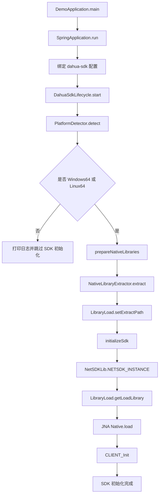

# 大华 SDK 启动初始化调用流程

本文档梳理 `dahua-sdk-java-demo` 在程序启动时，大华 SDK 从 Spring Boot 启动到原生库加载、JNA 绑定、`CLIENT_Init` 初始化的完整代码调用流程。

## 相关代码位置

- Spring Boot 启动入口：`src/main/java/com/csg/demo/DemoApplication.java`
- SDK 配置文件：`src/main/resources/application.yaml`
- SDK 配置绑定：`src/main/java/com/csg/demo/dahua/config/DahuaSdkProperties.java`
- 平台枚举：`src/main/java/com/csg/demo/dahua/config/DahuaPlatform.java`
- 平台检测：`src/main/java/com/csg/demo/dahua/support/PlatformDetector.java`
- 原生库提取：`src/main/java/com/csg/demo/dahua/support/NativeLibraryExtractor.java`
- SDK 生命周期：`src/main/java/com/csg/demo/dahua/lifecycle/DahuaSdkLifecycle.java`
- 官方动态库加载器：`src/main/java/com/csg/demo/dahua/lib/LibraryLoad.java`
- 官方 JNA 绑定入口：`src/main/java/com/csg/demo/dahua/lib/NetSDKLib.java`

## 总体流程



## 1. Spring Boot 启动入口

启动从 `DemoApplication.main` 开始：

```java
SpringApplication.run(DemoApplication.class, args);
```

`DemoApplication` 上有两个关键注解：

```java
@SpringBootApplication
@ConfigurationPropertiesScan
```

其中：

- `@SpringBootApplication` 启动 Spring Boot 应用并扫描组件。
- `@ConfigurationPropertiesScan` 会扫描 `@ConfigurationProperties` 配置类，使 `DahuaSdkProperties` 可以绑定 `application.yaml` 中的 `dahua-sdk` 配置。

## 2. 配置绑定阶段

配置来源是 `application.yaml`：

```yaml
dahua-sdk:
  windows64:
    libraries:
      - classpath:libs/win64/avnetsdk.dll
      - classpath:libs/win64/dhconfigsdk.dll
      - classpath:libs/win64/dhnetsdk.dll
      - classpath:libs/win64/play.dll
      - classpath:libs/win64/ImageAlg.dll
      - classpath:libs/win64/Infra.dll
      - classpath:libs/win64/IvsDrawer.dll
      - classpath:libs/win64/StreamConvertor.dll
      - classpath:libs/win64/libeay32.dll
      - classpath:libs/win64/ssleay32.dll
      - classpath:libs/win64/RenderEngine.dll
  linux64:
    libraries:
      - classpath:libs/linux64/libcrypto.so
      - classpath:libs/linux64/libssl.so
      - classpath:libs/linux64/libavnetsdk.so
      - classpath:libs/linux64/libdhconfigsdk.so
      - classpath:libs/linux64/libdhnetsdk.so
      - classpath:libs/linux64/libStreamConvertor.so
      - classpath:libs/linux64/libImageAlg.so
```

绑定类是 `DahuaSdkProperties`：

```java
@ConfigurationProperties(prefix = "dahua-sdk")
public class DahuaSdkProperties {
    private PlatformLibraries windows64 = new PlatformLibraries();
    private PlatformLibraries linux64 = new PlatformLibraries();
}
```

启动过程中，Spring Boot 会读取 `application.yaml`，并把：

- `dahua-sdk.windows64.libraries`
- `dahua-sdk.linux64.libraries`

绑定到 `DahuaSdkProperties.PlatformLibraries#libraries`。

绑定完成后，`DahuaSdkLifecycle` 可以通过下面代码读取当前平台对应的原生库列表：

```java
List<String> libraries = properties.getLibraries(platform).getLibraries();
```

## 3. Spring 生命周期触发 SDK 初始化

`DahuaSdkLifecycle` 实现了 `SmartLifecycle`：

```java
@Component
public class DahuaSdkLifecycle implements SmartLifecycle
```

关键返回值：

```java
public boolean isAutoStartup() {
    return true;
}

public int getPhase() {
    return Integer.MIN_VALUE;
}
```

含义：

- `isAutoStartup() = true`：Spring 容器启动时自动调用 `start()`。
- `getPhase() = Integer.MIN_VALUE`：尽量早执行，确保 SDK 初始化在其他业务组件使用 SDK 前完成。

启动时进入：

```java
DahuaSdkLifecycle.start()
```

## 4. 平台检测

`start()` 首先调用：

```java
DahuaPlatform platform = platformDetector.detect();
```

`PlatformDetector.detect()` 根据 JVM 系统属性判断平台：

```java
String osName = System.getProperty("os.name", "").toLowerCase(Locale.ROOT);
String arch = System.getProperty("os.arch", "").toLowerCase(Locale.ROOT);
```

判断规则：

| 条件 | 结果 |
| --- | --- |
| `os.arch` 是 `amd64` 或 `x86_64`，且 `os.name` 以 `windows` 开头 | `WINDOWS64` |
| `os.arch` 是 `amd64` 或 `x86_64`，且 `os.name` 以 `linux` 开头 | `LINUX64` |
| 其他情况 | `UNSUPPORTED` |

如果是非 Windows64 / Linux64：

```java
if (!platform.isSupported()) {
    log.warn("当前平台不支持大华 SDK 自动初始化: {}", platformDetector.currentPlatformDescription());
    return;
}
```

此时不会加载原生库，也不会调用 `CLIENT_Init`。

## 5. 准备原生库

支持平台会继续执行：

```java
prepareNativeLibraries(platform);
```

该方法做三件事：

```java
List<String> libraries = properties.getLibraries(platform).getLibraries();
Path libraryDirectory = nativeLibraryExtractor.extract(platform, libraries);
LibraryLoad.setExtractPath(libraryDirectory.toString());
```

### 5.1 获取当前平台库列表

`properties.getLibraries(platform)` 会根据平台返回：

- Windows64：`dahua-sdk.windows64.libraries`
- Linux64：`dahua-sdk.linux64.libraries`

### 5.2 复制 classpath 原生库到临时目录

`NativeLibraryExtractor.extract()` 负责将配置中的库复制到临时目录。

原因：JNA 不能直接加载 jar 内部的 `classpath:` 资源，必须加载文件系统上的真实文件。

核心流程：

```java
Path targetDirectory = Files.createTempDirectory("dahua-sdk-" + platform.getConfigKey() + "-");
for (String libraryLocation : libraryLocations) {
    Resource resource = resourceLoader.getResource(libraryLocation);
    copyResource(resource, libraryLocation, targetDirectory);
}
```

例如 Windows64 运行时可能生成：

```text
C:\Users\xxx\AppData\Local\Temp\dahua-sdk-windows64-123456789\
```

Linux64 运行时可能生成：

```text
/tmp/dahua-sdk-linux64-123456789/
```

复制后的目录中会包含该平台全部依赖库，例如：

```text
dhnetsdk.dll
dhconfigsdk.dll
avnetsdk.dll
...
```

或：

```text
libdhnetsdk.so
libdhconfigsdk.so
libavnetsdk.so
...
```

### 5.3 设置 `LibraryLoad` 的加载路径

复制完成后调用：

```java
LibraryLoad.setExtractPath(libraryDirectory.toString());
```

这一步非常关键。

`NetSDKLib` 内部会通过 `LibraryLoad.getLoadLibrary("dhnetsdk")` 获取动态库路径。如果没有提前设置 `EXTRACT_PATH`，`LibraryLoad` 会使用默认的 `java.io.tmpdir`，可能找不到刚复制好的 SDK 库。

## 6. 初始化 SDK

原生库准备完成后，进入：

```java
initializeSdk();
```

### 6.1 创建并保存回调对象

代码中创建两个回调：

```java
NetSDKLib.fDisConnect disconnect = ...
NetSDKLib.fHaveReConnect reconnect = ...
```

随后保存到成员变量：

```java
disconnectCallback = disconnect;
reconnectCallback = reconnect;
```

这样做的原因是：JNA 回调对象如果没有强引用，可能被 JVM 垃圾回收，导致后续原生回调异常。

### 6.2 触发 JNA 加载 NetSDK

关键代码：

```java
netSdk = NetSDKLib.NETSDK_INSTANCE;
```

首次访问 `NetSDKLib.NETSDK_INSTANCE` 时，会触发 `NetSDKLib` 中的静态字段初始化：

```java
NetSDKLib NETSDK_INSTANCE = Native.load(LibraryLoad.getLoadLibrary("dhnetsdk"), NetSDKLib.class);

NetSDKLib CONFIG_INSTANCE = Native.load(LibraryLoad.getLoadLibrary("dhconfigsdk"), NetSDKLib.class);
```

这一步会发生两类动作：

1. 调用 `LibraryLoad.getLoadLibrary("dhnetsdk")`，得到 `dhnetsdk.dll` 或 `libdhnetsdk.so` 的绝对路径。
2. JNA 调用 `Native.load(...)` 加载原生库，并创建 Java 接口代理。

## 7. `LibraryLoad.getLoadLibrary` 内部流程

调用示例：

```java
LibraryLoad.getLoadLibrary("dhnetsdk")
```

内部步骤如下：

### 7.1 判断当前平台目录

```java
currentFold = getLibraryFold();
```

`getLibraryFold()` 会返回：

| 平台 | 返回值 |
| --- | --- |
| Windows 64 位 | `win64` |
| Linux 64 位 | `linux64` |
| Linux 32 位 | `linux32` |
| macOS 64 位 | `mac64` |

### 7.2 读取 `dynamic-lib-load.xml`

首次调用时：

```java
dynamicParseUtil = new DynamicParseUtil(
    LibraryLoad.class.getClassLoader().getResourceAsStream("dynamic-lib-load.xml")
);
```

该 XML 用来描述不同平台需要的 SDK 原生库列表。

### 7.3 尝试按官方路径解压库

```java
for (String libName : dynamicParseUtil.getLibsSystem(currentFold)) {
    extractLibrary(libName);
}
```

官方 `LibraryLoad` 默认查找路径是：

```text
win64/dhnetsdk.dll
linux64/libdhnetsdk.so
```

而当前业务项目实际配置是：

```text
classpath:libs/win64/dhnetsdk.dll
classpath:libs/linux64/libdhnetsdk.so
```

所以当前项目真正可靠的原生库准备逻辑是 `NativeLibraryExtractor`，它已经提前把库复制到了临时目录。`LibraryLoad` 后续只需要根据 `EXTRACT_PATH` 拼出最终加载路径。

### 7.4 生成真实库文件名

```java
String fullName = getLibraryName(libraryName);
```

转换规则：

| 输入 | Windows64 | Linux64 |
| --- | --- | --- |
| `dhnetsdk` | `dhnetsdk.dll` | `libdhnetsdk.so` |
| `dhconfigsdk` | `dhconfigsdk.dll` | `libdhconfigsdk.so` |
| `ImageAlg` | `ImageAlg.dll` | `libImageAlg.so` |
| `crypto` | `crypto.dll` 或配置名 | `libcrypto.so` |

### 7.5 返回绝对路径

```java
return path + fullName;
```

例如：

```text
C:/Users/xxx/AppData/Local/Temp/dahua-sdk-windows64-xxx/dhnetsdk.dll
```

或：

```text
/tmp/dahua-sdk-linux64-xxx/libdhnetsdk.so
```

这个路径会交给 JNA 的 `Native.load(...)`。

## 8. 调用 `CLIENT_Init`

JNA 加载成功后，继续执行 SDK 初始化：

```java
boolean initSuccess = netSdk.CLIENT_Init(disconnect, null);
```

如果失败：

```java
throw new IllegalStateException(
    String.format("CLIENT_Init failed, last error: 0x%x", netSdk.CLIENT_GetLastError())
);
```

如果成功，继续设置：

```java
netSdk.CLIENT_SetAutoReconnect(reconnect, null);
netSdk.CLIENT_SetConnectTime(5000, 1);
netSdk.CLIENT_SetNetworkParam(netParam);
```

含义：

| 调用 | 作用 |
| --- | --- |
| `CLIENT_Init` | 初始化大华 SDK 全局环境 |
| `CLIENT_SetAutoReconnect` | 注册断线重连成功回调 |
| `CLIENT_SetConnectTime` | 设置登录连接超时和重试次数 |
| `CLIENT_SetNetworkParam` | 设置更细的网络参数，如连接超时、获取设备信息超时 |

至此，SDK 初始化完成。

## 9. 完整调用链

```text
DemoApplication.main
  └─ SpringApplication.run
      ├─ 扫描 @ConfigurationPropertiesScan
      ├─ 创建 DahuaSdkProperties
      ├─ 绑定 application.yaml 中 dahua-sdk 配置
      ├─ 创建 DahuaSdkLifecycle
      └─ Spring 生命周期启动
          └─ DahuaSdkLifecycle.start
              ├─ PlatformDetector.detect
              │   ├─ Windows64 → 继续
              │   ├─ Linux64 → 继续
              │   └─ 其他平台 → 打日志并跳过
              ├─ prepareNativeLibraries
              │   ├─ DahuaSdkProperties.getLibraries
              │   ├─ NativeLibraryExtractor.extract
              │   │   ├─ ResourceLoader.getResource
              │   │   ├─ Resource.getInputStream
              │   │   └─ Files.copy 到临时目录
              │   └─ LibraryLoad.setExtractPath
              └─ initializeSdk
                  ├─ 创建断线回调
                  ├─ 创建重连回调
                  ├─ NetSDKLib.NETSDK_INSTANCE
                  │   ├─ LibraryLoad.getLoadLibrary("dhnetsdk")
                  │   └─ Native.load(...)
                  ├─ NetSDKLib.CONFIG_INSTANCE
                  │   ├─ LibraryLoad.getLoadLibrary("dhconfigsdk")
                  │   └─ Native.load(...)
                  ├─ CLIENT_Init
                  ├─ CLIENT_SetAutoReconnect
                  ├─ CLIENT_SetConnectTime
                  └─ CLIENT_SetNetworkParam
```

## 10. 程序关闭时的清理流程

`DahuaSdkLifecycle` 也负责关闭阶段清理：

```java
public void stop() {
    if (initialized && netSdk != null) {
        netSdk.CLIENT_Cleanup();
    }
}
```

触发场景：

- Spring Boot 正常停止
- JVM 退出
- Actuator shutdown
- Spring 容器关闭

调用链：

```text
Spring 容器关闭
  └─ DahuaSdkLifecycle.stop
      ├─ CLIENT_Cleanup
      ├─ initialized = false
      ├─ running = false
      ├─ netSdk = null
      ├─ disconnectCallback = null
      └─ reconnectCallback = null
```

## 11. 关键注意点

### 11.1 必须先准备原生库，再访问 `NetSDKLib.NETSDK_INSTANCE`

正确顺序：

```text
NativeLibraryExtractor.extract
  → LibraryLoad.setExtractPath
  → NetSDKLib.NETSDK_INSTANCE
```

错误顺序：

```text
NetSDKLib.NETSDK_INSTANCE
  → LibraryLoad 还不知道临时库目录
  → Native.load 找不到 dhnetsdk
```

### 11.2 `classpath:` 资源不能直接给 JNA 加载

下面路径对 Spring 有效：

```text
classpath:libs/win64/dhnetsdk.dll
```

但对 JNA 无效。JNA 必须拿到真实文件路径，例如：

```text
C:/Users/xxx/AppData/Local/Temp/dahua-sdk-windows64-xxx/dhnetsdk.dll
```

所以需要 `NativeLibraryExtractor` 做复制。

### 11.3 回调对象必须保存强引用

以下成员变量不能随意删除：

```java
private Object disconnectCallback;
private Object reconnectCallback;
```

它们用于持有 JNA 回调对象，防止被 JVM 回收。

### 11.4 非支持平台不会初始化

如果运行平台不是 Windows64 或 Linux64：

```text
当前平台不支持大华 SDK 自动初始化: xxx/xxx
```

SDK 不会加载，也不会调用 `CLIENT_Init`。

## 12. 启动成功后的状态

启动成功后：

- SDK 原生库已被复制到临时目录。
- JNA 已加载 `dhnetsdk` 和 `dhconfigsdk`。
- `CLIENT_Init` 已执行成功。
- 自动重连回调已注册。
- 网络连接参数已设置。
- 后续业务代码可以基于 `NetSDKLib.NETSDK_INSTANCE` 继续做登录、预览、报警订阅等操作。
